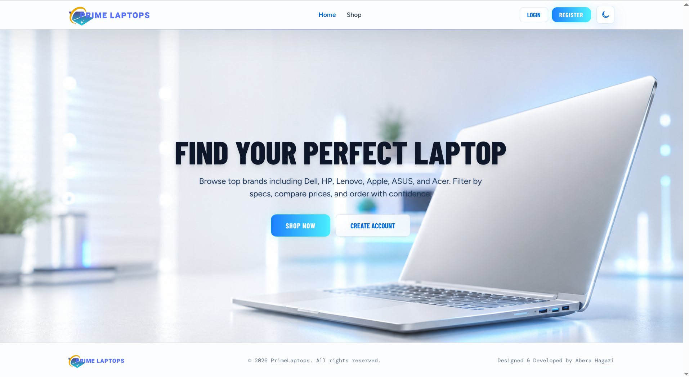
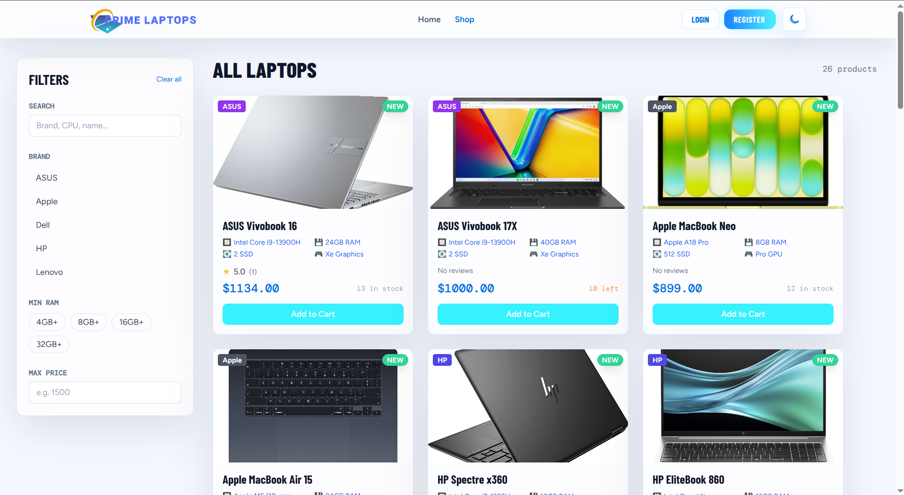

# 🚀 Prime Laptops Store

A full-stack multi-brand laptop e-commerce platform built with **React 18**, **Node.js/Express**, and **PostgreSQL**.

[](https://prime-laptops-store.vercel.app)
[](https://nodejs.org)
[](https://reactjs.org)
[](https://www.postgresql.org)
[](https://vercel.com)
[](https://render.com)
[](https://opensource.org/licenses/MIT)

## 📖 Description

Prime Laptops Store is a comprehensive e-commerce solution for multi-brand laptop retail. It features a modern, responsive frontend with a robust backend API, complete with admin management, real-time notifications, and enterprise-grade security.

## 🌐 Live Links

- **Frontend:** [https://prime-laptops-store.vercel.app](https://prime-laptops-store.vercel.app)

## 🛠️ Tech Stack

### Frontend
- React 18 with React Router v6
- Tailwind CSS for styling
- Axios for HTTP requests
- react-hot-toast for notifications
- Context API for state management

### Backend
- Node.js & Express.js
- JWT authentication with refresh token rotation
- bcryptjs for password hashing
- Helmet for security headers
- express-rate-limit for API throttling
- express-validator for input validation
- Pino for logging
- Prometheus metrics for monitoring

### Database
- PostgreSQL (hosted on Neon)

### Deployment
- Frontend: Vercel
- Backend: Render
- Database: Neon (PostgreSQL)

## ✨ Features

### 🛒 Product Management
- Product catalog with advanced filters (brand, RAM, storage, price range, search)
- Dynamic brand filtering from database
- Product image gallery (up to 3 images per product)
- "NEW" badge on products added within 28 days
- Pagination for product listings

### 👤 User Authentication
- User registration and login
- JWT access tokens with refresh token rotation
- Secure password hashing with bcrypt
- Session management

### 🛍️ Shopping Experience
- Shopping cart (add, update quantity, remove, clear)
- Persistent cart storage
- Checkout with stock validation
- Order history and status tracking

### ⭐ Reviews & Ratings
- Product reviews and ratings (1-5 stars)
- User review management

### 📧 Notifications
- Email notifications when order status changes

### 🔧 Admin Dashboard
- Full product CRUD (create, edit, delete)
- Bulk delete products
- Order status management
- Store settings and preferences
- Activity logs
- Analytics and statistics

### 🎨 UI/UX
- Dark/light mode toggle
- Responsive design (mobile, tablet, desktop)
- Clean, modern interface

### 🔒 Security
- Helmet security headers
- CORS whitelist configuration
- Rate limiting to prevent abuse
- Input validation with express-validator
- bcrypt password hashing
- Parameterized SQL queries (SQL injection safe)
- JWT token security

## 📁 Project Structure

```
prime-laptops-store/
├── backend/          # Express API server
│   ├── config/       # DB pool, env validation, Pino logger
│   ├── controllers/  # Auth, Products, Cart, Orders, Settings
│   ├── middleware/    # JWT auth, admin guard, security, metrics, validation
│   ├── routes/       # Route definitions with express-validator
│   ├── utils/        # AppError, auth helpers (JWT signing, cookies)
│   └── server.js     # Entry point
├── src/              # React frontend
│   ├── components/   # Navbar, ProductCard, StarRating, ProtectedRoute
│   ├── context/      # AuthContext, CartContext
│   ├── pages/        # Home, Products, ProductDetail, Cart, Orders, Auth, Admin
│   └── utils/        # Axios client with JWT interceptor, token store
├── database/         # SQL schema, migrations, seed data
└── public/           # Static assets
```

### 🗄️ Database Schema

**Tables:**
- `users` - User accounts and authentication
- `products` - Laptop products with details
- `cart` - Shopping cart items
- `orders` - Customer orders
- `order_items` - Individual items in orders
- `refresh_tokens` - JWT refresh tokens
- `store_settings` - Store configuration
- `admin_preferences` - Admin user preferences
- `admin_activity_logs` - Admin action tracking
- `schema_migrations` - Database migration history
- `reviews` - Product reviews and ratings

## 📡 API Endpoints

### Authentication (`/api/auth`)
| Method | Endpoint | Auth | Description |
|--------|----------|------|-------------|
| POST | `/register` | Public | Create new user account |
| POST | `/login` | Public | Login and receive JWT tokens |
| POST | `/refresh` | Cookie | Rotate refresh token |
| POST | `/logout` | Cookie | Revoke session |
| GET | `/me` | JWT | Get current user profile |

### Products (`/api/products`)
| Method | Endpoint | Auth | Description |
|--------|----------|------|-------------|
| GET | `/` | Public | List products (filterable, paginated) |
| GET | `/:id` | Public | Get product details with reviews |
| POST | `/` | Admin | Create new product |
| PUT | `/:id` | Admin | Update product |
| DELETE | `/:id` | Admin | Delete product |
| GET | `/brands` | Public | Get all available brands |
| POST | `/:id/reviews` | JWT | Add product review |


### Cart (`/api/cart`) - All require JWT
| Method | Endpoint | Description |
|--------|----------|-------------|
| GET | `/` | Get user's cart |
| POST | `/add` | Add item to cart |
| PUT | `/:id` | Update cart item quantity |
| DELETE | `/:id` | Remove item from cart |
| DELETE | `/clear` | Clear entire cart |

### Orders (`/api/orders`)
| Method | Endpoint | Auth | Description |
|--------|----------|------|-------------|
| POST | `/checkout` | JWT | Create order from cart |
| GET | `/` | JWT | Get user's orders |
| GET | `/:id` | JWT | Get order details |
| PUT | `/:id/status` | Admin | Update order status |
| GET | `/stats` | Admin | Get order statistics |


## 🚀 Local Setup
 
**1. Clone**
```bash
git clone https://github.com/abera-dev/prime-laptops-store.git
cd prime-laptops-store
```
 
**2. Install Dependencies**
```bash
npm install
```
 
**3. Environment Variables**
 
Create a `.env` file:
```env
REACT_APP_API_URL=your_backend_api_url
```
 
**4. Run Dev Server**
```bash
npm start
```
 

## 📸 Screenshots


*Home page with hero section and product listing*


*Product catalog with filters, search, and grid view*


## 📝 License

This project is licensed under the MIT License - see the [LICENSE](LICENSE) file for details.


